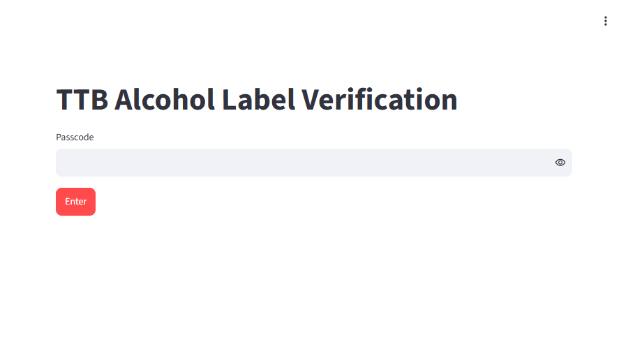
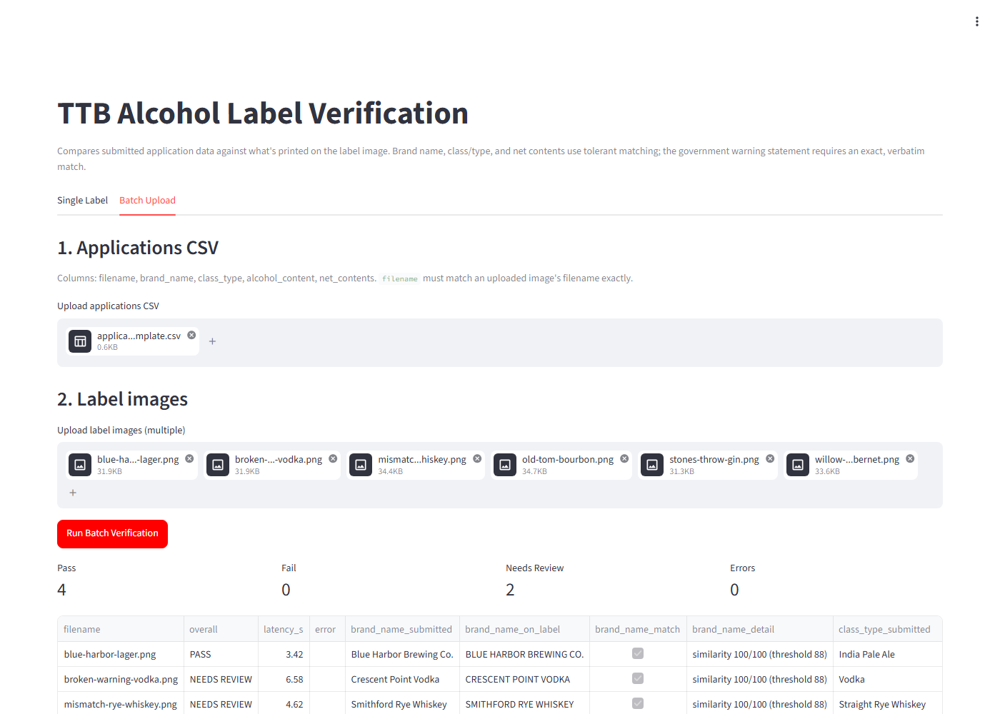
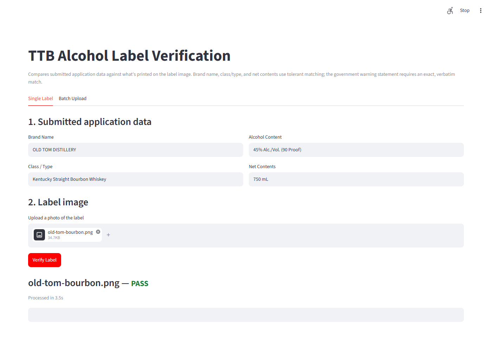

# TTB Alcohol Label Verification — Prototype

A prototype that checks whether an alcohol beverage label image matches the
data submitted on its application: brand name, class/type, alcohol content,
net contents, name and address of the bottler/producer, country of origin
(imports only), and the mandatory government warning statement.

## Screenshots

All taken against the live Cloud Run deployment, not a local dev server.

**Passcode gate** — every visitor sees this first; see "Access control"
below for why:



**Batch Upload** — 6 labels processed in one run (4 pass, 2 correctly
routed to "needs review" for a genuine ABV mismatch and a broken warning
heading):



**Single Label** — one image verified against submitted application data:



## Setup

```bash
python -m venv .venv
source .venv/bin/activate        # Windows: .venv\Scripts\activate
pip install -r requirements.txt
cp .env.example .env             # then fill in credentials, see below
```

Credentials: set `ANTHROPIC_API_KEY` (from console.anthropic.com) in `.env`.
This is the primary and only path currently in use — see "Why direct API,
not Vertex" below for why. `GOOGLE_CLOUD_PROJECT` is still supported in
`extraction.py` if Vertex access becomes available later.

## Run locally

```bash
streamlit run app.py
```

Opens at `http://localhost:8501`. Use the **Single Label** tab for one
image, or **Batch Upload** for a CSV of applications plus many images at
once (see `sample_data/applications_template.csv` for the expected CSV
shape, and `sample_data/label_test_plan.md` for the exact label wording
used to test each field-matching rule).

## Deploy to Cloud Run

**Live deployment:** https://ttb-label-verification-763207276979.us-east5.run.app
-- publicly reachable at the HTTP level, but gated by an in-app passcode
(see "Access control" below). Ask for the passcode if you don't have it.

```bash
echo -n "<your-anthropic-api-key>" | gcloud secrets create anthropic-api-key --data-file=-
echo -n "<your-chosen-passcode>" | gcloud secrets create app-passcode --data-file=-

# The Cloud Run service's default compute service account needs explicit
# access to read each secret -- deploy fails without this, with a clear
# "Permission denied on secret" error naming the account to grant.
for secret in anthropic-api-key app-passcode; do
  gcloud secrets add-iam-policy-binding "$secret" \
    --member="serviceAccount:<PROJECT_NUMBER>-compute@developer.gserviceaccount.com" \
    --role="roles/secretmanager.secretAccessor"
done

gcloud run deploy ttb-label-verification \
  --source . \
  --region us-east5 \
  --set-secrets ANTHROPIC_API_KEY=anthropic-api-key:latest,APP_PASSCODE=app-passcode:latest \
  --allow-unauthenticated
```

## Access control

Cloud Run IAM auth (`--no-allow-unauthenticated`) was the first approach
here, and it worked, but it means whoever needs to test the app has to be
individually granted a Google Cloud IAM role and either run
`gcloud run services proxy` or send authenticated requests -- real
friction for someone who just wants to click a link and try a prototype.

**Current approach: an app-level passcode gate instead** (`require_passcode()`
in `app.py`, checked via `secrets.compare_digest` against the `APP_PASSCODE`
env var). Cloud Run itself is public again
(`--allow-unauthenticated`); the app is the gatekeeper. Whoever has the
URL *and* the passcode gets in -- no Google account, no `gcloud`, no proxy
tunnel. It's a weaker security boundary than IAM (a shared secret, no
per-user audit trail) but the actual goal was stopping randoms/bots from
burning a personal Anthropic API key on an open URL, not protecting
something that needs real access control -- a passcode fully solves that
problem with far less friction for a take-home reviewer.

`APP_PASSCODE` unset entirely (the default for local dev) means no gate
at all -- there's no reason to password-protect your own machine. A
secret that's *present but resolves empty* (a botched Secret Manager
value, say) is treated differently on purpose: `require_passcode()` fails
closed with an error rather than silently treating blank the same as
unset, which would have quietly made a paid deployment fully public with
no warning. A wrong passcode guess also costs a fixed ~1.5s delay before
the "Incorrect passcode" error renders -- not real rate limiting, but it
turns unlimited free guessing into something with an actual cost.

**Reliability history:** the first interaction right after entering the
passcode used to intermittently not register against the live deployment
(confirmed via repeated automated testing, not a one-off -- a bad run
could fail 7 of 8 attempts). A follow-up review (`/code-review high`)
found the actual cause: `app.py`'s passcode form was plain
`st.text_input` + `st.button`, which is two separate reruns (fill, then
submit) instead of one atomic submission, and the test driver was
deciding whether the app was gated from an instant, zero-wait DOM check
that could race Streamlit's own rendering. Fixed both -- the form is now
`st.form` (atomic submit, real Enter-to-submit for free), and the driver
waits properly instead of guessing. Verified clean: 7 consecutive runs
against production with zero retries needed, versus frequent retries
before the fix.

**Deployment gotchas hit and fixed:**

- **`echo -n` (or equivalent) is load-bearing** when creating the secret --
  piping a value that includes a trailing newline (e.g. `grep KEY .env |
  cut -d= -f2- | gcloud secrets create ...` without stripping it) produces
  an API key with `\n` on the end. The app doesn't fail to *authenticate*
  with that; it fails earlier, with `httpx.LocalProtocolError: Illegal
  header value` wrapped in a generic `anthropic.APIConnectionError:
  Connection error.` -- a confusing error to trace back to "the secret has
  a stray newline" without reading the full traceback. Verify with `...|
  wc -c` locally vs `gcloud secrets versions access` on the deployed
  version -- the byte counts should match exactly.
- **`python:3.11-slim` needs `ca-certificates` installed explicitly**
  (see `Dockerfile`) for outbound HTTPS to work reliably -- without it,
  calls to the Anthropic API can fail the same generic "Connection error."
  way, which is why the fix above wasn't obvious from the error message
  alone; both were suspects until logs confirmed which one it actually was.
- **The original exception handler swallowed the real error.** `app.py`
  caught extraction failures and stored `str(exc)` for display in the UI,
  but never logged anything -- so Cloud Run's logs were empty of any
  useful detail even though the app was failing on every single label.
  Fixed by adding `logger.exception(...)` alongside the caught exception,
  which is what actually surfaced the traceback above. Worth calling out
  as a general lesson: catch-and-display-in-UI is not a substitute for
  catch-and-log for a deployed service.

## Approach

- **Extraction**: the label image is sent to Claude with a forced tool call
  (`record_label_fields`) so the model returns structured JSON directly,
  rather than free text we'd have to parse. Claude is told to transcribe
  fields as printed, not to correct or interpret them — judgment about
  whether a transcription *matches* the application happens afterward, in
  plain Python, not inside the model call.
- **Matching is deliberately split into several rules**, because the
  fields being checked have different tolerance requirements. Covers
  every field the brief's "Additional Context" section names, not just
  the five in its worked example:
  - Brand name, class/type, net contents, and name/address of the
    bottler/producer use **fuzzy matching** (`rapidfuzz`,
    case/punctuation-insensitive, similarity threshold 88/100). This is
    the "STONE'S THROW" vs "Stone's Throw" case — technically not
    identical strings, but the same brand, and a compliance agent's own
    judgment would pass it.
  - Alcohol content is parsed to a number and compared with a small
    tolerance (±0.3%), since ABV is numeric, not a string-similarity
    problem.
  - Country of origin uses **containment matching**, not a straight fuzzy
    ratio: real labels print "Product of Italy" or "Made in Italy" while
    an application typically just says "Italy," and a plain similarity
    ratio penalizes that length difference even though the country
    matches exactly. Required only for imports — legitimately blank on
    both sides for domestic products, which counts as a match rather
    than a missing-field failure.
  - The **government warning statement is checked with exact, verbatim text
    comparison** against the required statutory wording (27 CFR 16.21),
    plus a separate check that "GOVERNMENT WARNING:" is both all-caps and
    bold. This is intentionally *not* fuzzy — a title-cased or reworded
    warning is a real rejection, not a near-match, so this rule is
    deterministic and auditable rather than left to model judgment.
- **Batch mode** processes uploaded images concurrently (bounded to 8
  workers) rather than one at a time, since a 200-300-label importer dump
  processed sequentially against a per-label API call would take far too
  long to be usable.
- **UI**: a single Streamlit page, two tabs, plain form fields, and
  color-coded PASS/FAIL/NEEDS REVIEW badges — deliberately avoids anything
  that requires hunting for a button or reading documentation first.

## Why direct API, not Vertex

The original plan was to call Claude through Vertex AI, staying inside the
GCP project for the Cloud Run deployment. In practice this hit a hard wall:

1. A freshly-created GCP project has **zero request quota** for every
   partner/publisher model (Claude, Llama, etc.) — confirmed via
   `gcloud alpha services quota list`, which showed no `defaultLimit` set
   for any `anthropic-*` base model, unlike Google's own models.
2. Requesting a quota increase failed with "not eligible... at this time,"
   because quota can't be granted for a model the project hasn't been
   approved to access yet.
3. That approval turned out to require submitting a **business
   verification form** to Anthropic (business name, business website,
   industry) via Model Garden — a real commercial-access gate, not a
   formality. It doesn't fit an individual prototype with no business
   entity, so filling it out with placeholder information wasn't an option.

Direct API access (console.anthropic.com) has no such business-verification
requirement for individual use, so that became the primary path.
`extraction.py` still supports `GOOGLE_CLOUD_PROJECT` for Vertex in case
that access is granted later — confirmed working values, found by testing
directly against the live API rather than guessing from docs, are region
`global` and model id `claude-sonnet-5` (no date suffix).

## Model choice: Sonnet 5 over Haiku 4.5

Tested both on the same label image (uncached, direct API, this dev
machine's network):

| Model | Latency | Warning bold/caps detection (3 trials) |
| --- | --- | --- |
| Sonnet 5 | ~5.0s | Correct |
| Haiku 4.5 | ~3.0–3.8s | **Wrong on 1 of 3 trials** |

Haiku is faster but was inconsistent on exactly the field the brief singles
out as needing to be exact -- the `GOVERNMENT WARNING:` bold/caps check
("word-for-word... has to be exact," per Jenny Park). A faster model that's
non-deterministic on the strictest compliance field is a worse trade than a
slower one that gets it right, so Sonnet 5 is the default despite sitting
at the edge of the 5-second target. It's still roughly 6-8x faster than the
30-40s vendor-pilot failure Sarah Chen described, which is the bar that
actually matters. Swap the model via `CLAUDE_MODEL_API` if this trade-off
should go the other way for a given deployment.

## Bugs found through testing

Two real defects surfaced by testing against actual images (a synthetic
label with a plain, non-bold font never would have caught either):

1. **False negatives on legitimately all-caps labels.** Two real bottle
   photos (`sample_data/label-3.jpg`, `label-4.jpg`) print the *entire*
   warning statement in caps as a style choice -- compliant, but the
   exact-match check was comparing against mixed-case reference text and
   failed on case alone. Jenny's actual requirement was narrower than what
   the code enforced: *"the 'GOVERNMENT WARNING:' part has to be in all
   caps and bold"* -- she scoped the caps requirement to the heading, not
   the whole statement. Fixed by comparing wording case-insensitively in
   `matching.py`, while still checking the heading's caps/bold state as a
   separate, independent signal from the image itself -- so this doesn't
   weaken detection of Jenny's actual title-case violation (test label
   `broken-warning-vodka.png` still correctly fails for that reason).
2. **Inconsistent extraction of the warning heading.** On one label, Claude
   correctly identified that the heading was bold/all-caps, but the
   `warning_statement_text` field it returned sometimes omitted the
   "GOVERNMENT WARNING:" heading itself, capturing only the body -- which
   the exact-match check correctly read as *no heading present at all*.
   Fixed by tightening the tool schema description in `extraction.py` to
   explicitly require the heading as the first words of that field.

Both fixes were verified by running all 6 test-plan labels through the
pipeline twice (12 runs total) and confirming every result matched the
expected verdict both times.

**Known remaining limitation:** Claude Sonnet 5 has deprecated the
`temperature` parameter outright (the API rejects the request if it's
set), so there's no way to force fully deterministic output. Some
call-to-call variance in exact transcription is possible and was observed
during testing -- routing borderline cases to "NEEDS REVIEW" rather than
auto-rejecting is the mitigation, not elimination of the variance itself.

## Assumptions & trade-offs

- **This prototype makes outbound calls to Claude for every label.** A
  production deployment behind a restrictive firewall would need those
  domains allow-listed — flagging this explicitly since a prior scanning
  vendor pilot reportedly broke on exactly this kind of outbound-domain
  restriction.
  - Total latency includes network+model time; if this is deployed for
    real, cold-start on Cloud Run's first request in a while should also be
    accounted for separately from the per-label latency shown in the UI.
- **"Needs review" exists as a third state deliberately.** A binary
  pass/fail on a compliance tool would either be too strict (rejecting
  genuine near-matches) or too loose (silently accepting real mismatches).
  Partial matches route to a human instead of guessing.
- **No image preprocessing for skewed/glare/low-light photos.** Called out
  in interviews as explicitly out of scope for a prototype; Claude's vision
  handles moderately imperfect images reasonably but this isn't tuned or
  tested against adversarial photo quality.
- **No data is persisted.** Images and results live only in the Streamlit
  session; nothing is written to a database or disk. Reasonable for a
  prototype but not sufficient for a production system that would need
  audit trails and document retention policy compliance.
- **Batch CSV matching is by filename**, not a more robust identifier
  (e.g. COLA application ID), since the prototype has no application
  system to pull real identifiers from.
- **ABV tolerance (±0.3%) and fuzzy-match threshold (88/100) are
  placeholders**, not sourced from actual TTB tolerance regulations, which
  vary by beverage type. A real deployment should get these from
  compliance SMEs rather than engineering judgment.
